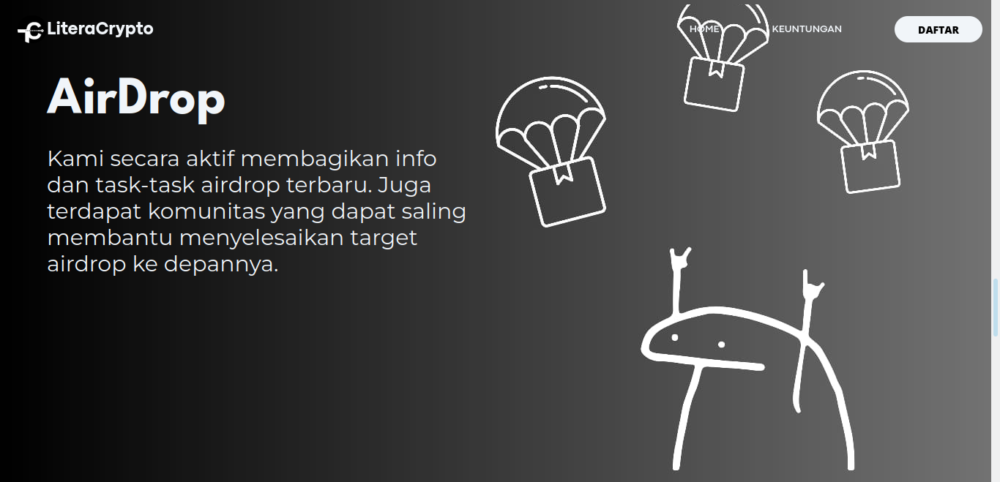

# LiteraCrypto

LiteraCrypto is a platform that provides users with the best guidance and advice to help them navigate the market and achieve maximum profit.

## Screenshots

### Screenshot 1

**Description:**
The first screenshot displays the homepage of LiteraCrypto. The primary focus is on a welcoming message written in Indonesian, which translates to "Get Maximum Profit With Us." The text below further explains that the platform offers the best guidance and advice to users, especially those entering the market for the first time. The call-to-action button labeled "LEBIH LANJUT" invites users to learn more about the services provided.

### Screenshot 2

**Description:**
The second screenshot highlights the "5x Portofolio" section of the LiteraCrypto website. The message translates to "5x Portfolio" and indicates that LiteraCrypto has a vision to help users achieve realistic portfolio growth targets of 3-5 times. The visual elements include upward trending arrows and icons representing various cryptocurrencies such as Bitcoin, Ethereum, and Solana, emphasizing the platform's focus on substantial growth and diversified investment strategies.

### Screenshot 3

**Description:**
The third screenshot showcases the "Beragam Keuntungan" section, which translates to "Various Benefits." This section outlines the main advantages offered by LiteraCrypto:
- **Analisa Coin (Coin Analysis):** In-depth technical and fundamental research on coins with significant growth potential.
- **Materi (Materials):** Comprehensive resources and educational materials on technical and fundamental aspects of promising coins.
- **Community:** A supportive community that provides in-depth research and discussions about coins with significant growth potential.

### Screenshot 4

**Description:**
The fourth screenshot provides a glimpse into the "Update Harian" section, which translates to "Daily Updates." This section is dedicated to providing users with regular daily updates on coin outlooks and the latest news related to the cryptocurrency market. The screenshot displays several charts and analysis reports, showcasing real-time market data and strategic insights. Users can see detailed technical analysis and projections for various cryptocurrencies, helping them make informed decisions based on the latest market trends.

### Screenshot 5

**Description:**
The fifth screenshot features the "AirDrop" section of the LiteraCrypto website. This section informs users about the active sharing of information and tasks related to the latest airdrops. It also highlights the community aspect, where members help each other to achieve future airdrop targets. The visual elements include parachute icons, emphasizing the concept of airdrops, and a playful graphic character, adding a touch of fun to the information.

### Screenshot 6

**Description:**
The sixth screenshot showcases the "Our Membership" section of the LiteraCrypto website. This section emphasizes that users do not need to pay exorbitant amounts, highlighting the affordability of the membership program. The membership options include:
- **Promo 100 Orang Pertama (Promo for the First 100 People):** Discounted price of $10.00 from the original $20.00.
- **1 Bulan Membership (1 Month Membership):** Discounted price of $15.00 from the original $20.00.
- **3 Bulan Membership (3 Months Membership):** Discounted price of $40.00 from the original $60.00.

The section encourages users to join by highlighting the cost-effective nature of the membership plans.

### Screenshot 7

**Description:**
The seventh screenshot highlights the "Let's Talk With Us" section of the LiteraCrypto website. This section emphasizes the importance of communication and interaction with the platform's team. It encourages users to reach out for support, inquiries, or further information. The text, written in Indonesian, translates to "We do not sell or trade our website anywhere with anyone. It is not allowed to duplicate, distribute, or use our content without written permission from LiteraCrypto."

This section also provides the platform's social media handles, encouraging users to connect via Instagram and Twitter (referred to as "X" in the screenshot) at @literacrypto. The visual design features a bold and inviting "Let's Talk With Us" headline, making it clear that user engagement and communication are highly valued by the platform.

## Features

- Comprehensive market guidance
- Expert advice and strategies
- User-friendly interface

## Getting Started

To get started with LiteraCrypto, visit our [website](https://literacrypto.vercel.app).

## Contributing

We welcome contributions to improve LiteraCrypto. Please submit a pull request or open an issue to discuss your ideas.

## License

This project is licensed under the MIT License - see the [LICENSE](LICENSE) file for details.
